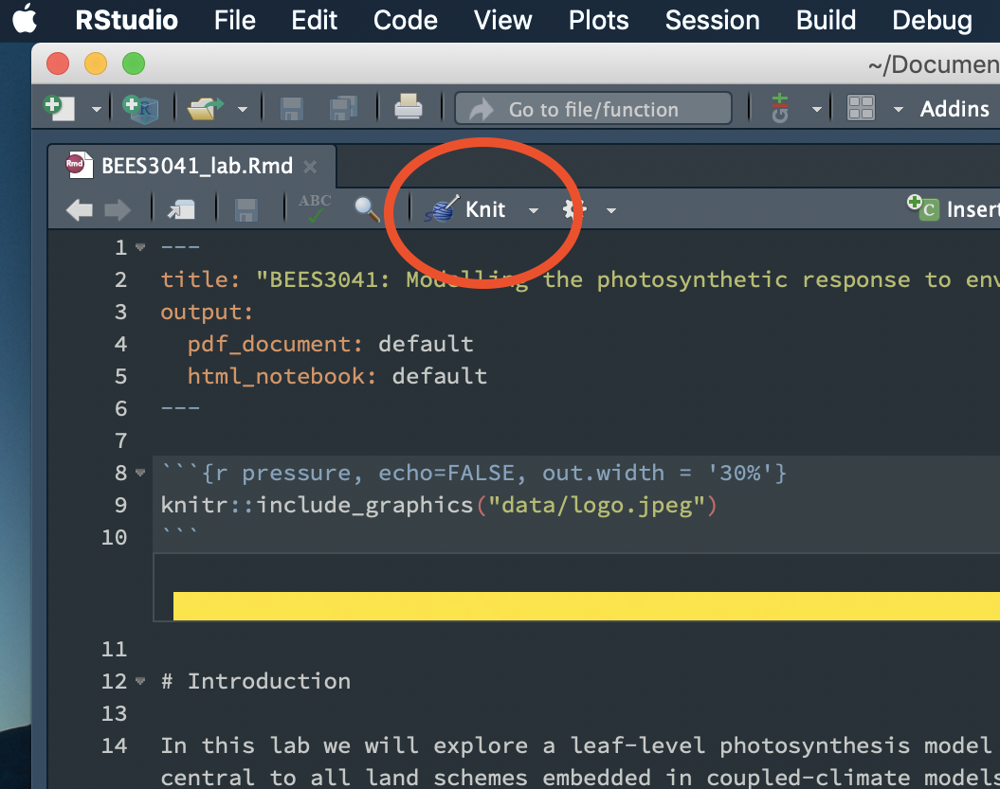

# BEES3041: Big Data in the Biological, Earth and Environmental Sciences

.

## Lab: Modelling the photosynthetic response to environmental conditions

### 10:00 am - 12:00 pm, 14th June, 2019 (T2)

In this lab we are going to explore the C~3~ leaf-level photosynthesis model proposed by Farquhar et al. (1980) and use this to simulate photosynthesis at leaf, ecosystem and global scale

We are going to use this model to:

* learn how leaf-level photosynthesis responds to changes in the environmental forcing (photosynthetically active radiation, temperature and carbon dioxide).
* simulate GPP at the ecosystem-scale (~1 km^2) using FLUXNET (eddy covariance) meteorological data.
* simulate a global estimate of GPP.

### Key References:

* Farquhar GD, Von Caemmerer S and Berry JA (1980) A
biochemical model of photosynthetic CO2 assimilation in leaves of C3 species. Planta 149: 78–90

### Running on your own computer

To run the practical:

1. Download or clone the entire repository, either:
    - Download the repository as a zip file, and uncompress it.
    - `git clone https://github.com/mdekauwe/BEES3041_lab_photosynthesis.git`
2. Then open up the [project file](BEES3041_lab.Rproj) in the repository folder in RStudio.
3. You will have to knit the [Rmd](BEES3041_lab.Rmd) file to generate the practical instructions. To do so, open the [Rmd](BEES3041_lab.Rmd) file and click the knit icon.

.
